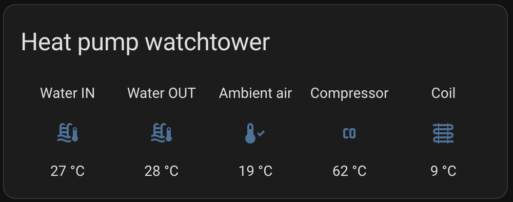

# ESP8266 Poolex Heatpump — Sniffer RS485 vers MQTT

Projet de reverse-engineering du protocole RS485 d'une pompe à chaleur **Poolex Jetline Selection 90** (fonctionne aussi sur la 95).

Le Wemos D1 Mini écoute passivement le bus RS485 entre la carte mère (PAC) et la télécommande filaire, décode les trames, et publie les valeurs sur MQTT pour **Home Assistant**.

## État du projet

✅ Fonctionnel — en production depuis mai 2026.

**Ce qui fonctionne :**
- Lecture des températures : eau entrée/sortie, air ambiant, serpentin (coil), gaz
- Lecture de l'état : PAC ON/OFF, chauffage actif (compresseur)
- Lecture de la consigne (setpoint) envoyée par la télécommande
- Lecture de la consigne confirmée par la PAC
- Publication MQTT sur changement + republication périodique (60s)
- Mise à jour OTA (Over The Air)
- Debug à distance via Telnet (RemoteDebug)

**Ce qui reste à faire :**
- Envoi de commandes à la PAC (consigne température, ON/OFF)
- Décodage complet de la partie "état machine" des trames longues
- Lecture des codes erreur

## Architecture

Le firmware complet tient dans un seul fichier : **`src/main.cpp`**.

```
┌─────────────┐     RS485      ┌──────────┐     MQTT      ┌────────────────┐
│   PAC       │◄──────────────►│ Wemos D1 │──────────────►│ Home Assistant │
│   Poolex    │     (9600 8N1) │ (sniffer)│               │                │
└─────────────┘                └──────────┘               └────────────────┘
       ▲                             ▲
       │        RS485                │
       └─────────────────────────────┘
              Télécommande filaire
```

**Topologie du bus :** trois appareils partagent le même bus RS485 half-duplex :
1. La carte mère PAC
2. La télécommande filaire d'origine
3. Le Wemos D1 Mini (sniffer passif — ne transmet jamais)

Le Wemos est câblé **en parallèle** avec la télécommande sur le même faisceau.

## Protocole du bus (Jetline 90/95)

### Caractéristiques
- Vitesse : **9600 baud, 8N1**
- Cycle : **~190 ms** (2 heartbeats par seconde)
- Séparateur inter-trames : octets `0x01` (idle bus)
- CPU cadencé à **160 MHz** pour traitement temps réel

### Types de trames identifiés

| Direction | En-tête | Taille | Description |
|-----------|---------|--------|-------------|
| remote → PAC | `XX 04 FF ...` | 12 B | Heartbeat télécommande (constant, ~98 ms) |
| PAC → remote | `FD XX ...` | 6–13 B | ACK PAC |
| PAC → remote | `[flags] <état> <capteurs>` | 25–36 B | Trame capteurs + état |

### Décodage des capteurs

Les **9 derniers octets** de chaque burst long (≥ 25 B) contiennent les capteurs, terminés par `FF FF` :

```cpp
water_in_temp    = ((0xFF - data[0]) >> 3) & 0x3F;  // °C
air_ambient_temp = ((0xFF - data[1]) >> 1) & 0x3F;  // °C
coil_temp        = ((0xFF - data[2]) >> 1) & 0x3F;  // °C
gas_temp         = ((0xFF - data[3]) >> 1) & 0x3F;  // °C
water_out_temp   = ((0xFF - data[4]) >> 1) & 0x3F;  // °C
// data[5] = 0xFF (constant)
active_status    = ((0xFF - data[6]) >> 4) & 0x01;  // 1 = PAC ON
// data[7-8] = FF FF (terminaison)
```

La validation se fait par plage de température (5–45 °C) — pas d'en-tête fixe.

### Consigne (setpoint)

La consigne est extraite de deux sources :
- **Télécommande** (heartbeat 12B) : byte offset 9 → `setpoint = ((0xFF - byte) >> 1) & 0x3F`
- **PAC** (trame d'état longue ≥15B) : byte offset 2 (ou 3 si préfixe FF) → `setpoint_confirmed = ((0xFF - byte) >> 3) & 0x3F`

### Mode de fonctionnement

Le **dernier byte** des trames d'état longues (≥15B avant le sensor tail) encode le mode :

| Byte | Mode | Valeur MQTT |
|------|------|-------------|
| `0x6C` | Chauffage seul | `heat` |
| `0x64` | Chauffage (variante) | `heat` |
| `0x54` | Automatique (chaud + froid) | `auto` |
| `0x5C` | Refroidissement seul | `cool` |

> ⚠️ Ces valeurs sont issues de l'analyse d'une capture. `0x64` apparaît lors de transitions ou après un power cycle — il est provisoirement mappé sur `heat`.

## Problème résolu : WiFi non réactif

### Le problème

Sur ESP8266, **SoftwareSerial désactive TOUTES les interruptions** pendant la réception de chaque byte (~1ms par byte à 9600 baud). Le stack WiFi (qui partage le même CPU) ne peut pas traiter les paquets entrants → ping timeout, OTA impossible, telnet inaccessible.

Paradoxalement, les publications MQTT sortantes fonctionnent (elles sont mises en file d'attente), mais tout ce qui nécessite une **réponse** entrante est bloqué.

### La solution

1. **Lecture non-bloquante** : on ne lit que `PS.available()` bytes, jamais de `readBytes()` bloquant avec timeout.

2. **Mini-throttle** : on attend au minimum 5 ms entre deux lectures (ou 20+ bytes disponibles) pour accumuler des bytes au lieu de lire un par un.

3. **Fenêtre WiFi pendant l'idle bus** : quand le bus est inactif (entre les cycles de trames), on coupe brièvement le RX SoftwareSerial (3 ms) pour laisser le stack WiFi traiter les paquets entrants.

```cpp
if (bus_is_idle && (now - last_wifi_window >= 50)) {
    PS.enableRx(false);
    delay(3);  // fenêtre WiFi
    PS.enableRx(true);
}
```

⚠️ **Ne jamais couper le RX pendant une trame active** — sinon on perd des bytes et les trames sont corrompues.

### Détection de l'idle bus

Le flag `bus_is_idle` passe à `true` quand :
- Le buffer résiduel est vide (tous les bursts ont été traités)
- Il ne reste que des octets `0x01` (séparateurs)
- Aucune nouvelle donnée depuis > 100 ms (timeout résiduel)

## Hardware

### Composants
- **Wemos D1 Mini** (ESP8266)
- **MAX485** — interface RS485
- **Convertisseur 12V → 5V** (min 2A)
- Couverture WiFi à l'emplacement de la PAC
- Boîtier IP67

### Câblage

#### PAC → MAX485
Le câble de la PAC a 4 fils :
- **Vert + Jaune** : bus RS485 → A et B du MAX485
- **Noir + Rouge** : alimentation 12V

#### MAX485 → Wemos D1 Mini

| Broche MAX485 | GPIO Wemos | Pin Wemos | Fonction |
|---------------|------------|-----------|----------|
| RO (sortie)   | GPIO4      | D2        | RX données |
| DI (entrée)   | GPIO5      | D1        | TX données |
| DE + RE       | GPIO14     | D5        | Contrôle direction |

⚠️ **NE PAS utiliser GPIO2 (D4)** pour DE/RE — ce pin est HIGH au boot (strapping pin ESP8266), ce qui activerait brièvement le transmetteur et corromprait le bus.

DE/RE sont reliés ensemble et maintenus à **LOW en permanence** (mode réception only).

### Alimentation
- Premier flash : via USB de l'ordinateur
- En fonctionnement : alimentation 12V de la PAC → convertisseur 12V/5V → Wemos (pin 5V) + MAX485 (VCC)

## Installation

### Prérequis
- [PlatformIO](https://platformio.org/platformio-ide) (VSCode ou CLI)

### Configuration initiale

```bash
# Copier le fichier de secrets
cp src/secrets.h.sample include/secrets.h
# Éditer avec vos paramètres WiFi et MQTT
```

Remplir dans `include/secrets.h` :
- `WIFI_SSID`
- `WIFI_PASSWORD`
- `MQTT_BROKER_ADDR`

### Compilation et flash

```bash
# Compiler
pio run

# Flash via USB (premier flash)
pio run -t upload

# Flash via OTA (après le premier flash)
pio run -t upload --upload-port 10.0.0.72
```

### Debug à distance

```bash
telnet <IP_DU_WEMOS>
```

Utiliser les commandes RemoteDebug pour changer le niveau de log (verbose, debug, info, warning, error).

## Topics MQTT

### Valeurs publiées (lecture)

| Topic | Description | Unité |
|-------|-------------|-------|
| `poolheater/values/water_in_temp` | Température eau entrée | °C |
| `poolheater/values/water_out_temp` | Température eau sortie | °C |
| `poolheater/values/air_ambient_temp` | Température air ambiant | °C |
| `poolheater/values/coil_temp` | Température serpentin | °C |
| `poolheater/values/gaz_temp` | Température gaz | °C |
| `poolheater/values/active_status` | PAC allumée | 0/1 |
| `poolheater/values/heating` | Compresseur actif | 0/1 |
| `poolheater/values/setpoint` | Consigne demandée (télécommande) | °C |
| `poolheater/values/setpoint_confirmed` | Consigne confirmée (PAC) | °C |
| `poolheater/values/mode` | Mode de fonctionnement | `heat` / `auto` / `cool` |
| `poolheater/values/state_raw` | Trame d'état brute (hex) | Pour analyse |
| `poolheater/status` | État connexion (retained) | ON |

### Commandes (écriture)

| Topic | Description |
|-------|-------------|
| `poolheater/command/probe` | Déclenche un test d'émission TX (expérimental) |

### Stratégie de publication
- Publication sur **changement de valeur** (pas de flood)
- **Republication complète toutes les 60 secondes** pour garantir la fraîcheur dans HA
- Reconnexion MQTT throttlée à 5 secondes entre les tentatives

## Intégration Home Assistant

Dans votre `configuration.yaml` :

```yaml
mqtt:
  sensor:
    - name: "Pool water temperature"
      state_topic: "poolheater/values/water_in_temp"
      force_update: true
      unit_of_measurement: "°C"
      unique_id: "pool_hp_water_in_temp"
      device_class: "temperature"

    - name: "Pool water OUT temperature"
      state_topic: "poolheater/values/water_out_temp"
      force_update: true
      unit_of_measurement: "°C"
      unique_id: "pool_hp_water_out_temp"
      device_class: "temperature"

    - name: "Heat pump status"
      state_topic: "poolheater/values/active_status"
      force_update: true
      unique_id: "pool_hp_status"

    - name: "Heat pump heating"
      state_topic: "poolheater/values/heating"
      force_update: true
      unique_id: "pool_hp_heating"

    - name: "Heat pump ambient air temperature"
      state_topic: "poolheater/values/air_ambient_temp"
      force_update: true
      unit_of_measurement: "°C"
      unique_id: "pool_hp_air_temp"
      device_class: "temperature"

    - name: "Heat pump gas temperature"
      state_topic: "poolheater/values/gaz_temp"
      force_update: true
      unit_of_measurement: "°C"
      unique_id: "pool_hp_gas_temp"
      device_class: "temperature"

    - name: "Heat pump coil temperature"
      state_topic: "poolheater/values/coil_temp"
      force_update: true
      unit_of_measurement: "°C"
      unique_id: "pool_hp_coil_temp"
      device_class: "temperature"

    - name: "Heat pump setpoint"
      state_topic: "poolheater/values/setpoint"
      force_update: true
      unit_of_measurement: "°C"
      unique_id: "pool_hp_setpoint"
      device_class: "temperature"

    - name: "Heat pump setpoint confirmed"
      state_topic: "poolheater/values/setpoint_confirmed"
      force_update: true
      unit_of_measurement: "°C"
      unique_id: "pool_hp_setpoint_confirmed"
      device_class: "temperature"

    - name: "Heat pump mode"
      state_topic: "poolheater/values/mode"
      force_update: true
      unique_id: "pool_hp_mode"
```

### Valeurs du mode

| Valeur MQTT | Mode | Description |
|-------------|------|-------------|
| `heat` | Chauffage seul | Mode 2 — la PAC chauffe uniquement |
| `auto` | Automatique | Mode 1 — chauffage + refroidissement |
| `cool` | Refroidissement seul | Mode 0 — la PAC refroidit uniquement |



## Calcul d'efficience (COP et puissance thermique)

Pour visualiser l'efficience de la PAC dans Home Assistant, on utilise des **template sensors** qui calculent :
- **Delta T** : différence entre water_out et water_in (°C)
- **Puissance thermique** : P = débit × ΔT × 1.163 (kW)
- **COP estimé** : basé sur la courbe constructeur Poolex Jetline 90 en fonction de la température air

### Configuration Home Assistant

Ajouter dans `configuration.yaml` :

```yaml
# --- Input number pour le débit PAC ---
input_number:
  pool_hp_flow_rate:
    name: "Débit PAC (m³/h)"
    min: 1
    max: 6
    step: 0.1
    initial: 3
    unit_of_measurement: "m³/h"
    icon: mdi:water-pump

# --- Template sensors pour l'efficience ---
template:
  - sensor:
      - name: "Pool HP Delta T"
        unique_id: "pool_hp_delta_t"
        unit_of_measurement: "°C"
        device_class: "temperature"
        state: >
          
          
          
            {{ (t_out - t_in) | round(1) }}
          
            unknown
          

      - name: "Pool HP Puissance thermique"
        unique_id: "pool_hp_thermal_power"
        unit_of_measurement: "kW"
        device_class: "power"
        state: >
          
          
          
          
          
            {{ (flow * delta * 1.163) | round(2) }}
          
            0
          

      - name: "Pool HP COP estimé"
        unique_id: "pool_hp_cop_estimated"
        unit_of_measurement: "COP"
        icon: mdi:lightning-bolt-circle
        state: >
          {# COP estimé Poolex Jetline 90 selon température air #}
          {# Courbe constructeur approximée : COP ≈ 3.0 + (T_air - 15) × 0.15 #}
          {# Plafonné entre 2.5 et 7.0 #}
          
          
          
            
            {{ [2.5, [cop, 7.0] | min] | max | round(1) }}
          
            unknown
          

      - name: "Pool HP Puissance électrique estimée"
        unique_id: "pool_hp_electrical_power"
        unit_of_measurement: "kW"
        device_class: "power"
        state: >
          
          
          
            {{ (thermal / cop) | round(2) }}
          
            0
          
```

### Notes sur le COP

La courbe COP est **approximée** à partir des données constructeur de la Jetline Selection 90 :

| Temp. air | COP estimé | Puissance thermique |
|-----------|-----------|-------------------|
| 10°C | ~2.3 | ~5.5 kW |
| 15°C | ~3.0 | ~7.0 kW |
| 20°C | ~3.8 | ~8.5 kW |
| 26°C | ~4.6 | ~9.5 kW |
| 30°C | ~5.3 | ~10 kW |

> ⚠️ Le COP réel dépend aussi de la température de l'eau et de l'humidité. Pour un COP précis, il faudrait un compteur électrique (type Shelly 1PM) sur l'alimentation de la PAC.

> 💡 **Débit PAC** : Ajustez `input_number.pool_hp_flow_rate` selon votre installation. La Poolex Jetline 90 recommande 1.5–3.5 m³/h à travers l'échangeur (pas le débit total de la pompe de filtration).

## Fichiers de log de trames

Le répertoire `src/frame_logs/` contient des captures brutes du bus UART pour le reverse-engineering :
- Captures avec télécommande + PAC (trames 12-36 B)
- `motherboard_only.txt` : PAC seule sans télécommande (trames 93 B commençant par `0x0C`)

## Références

- Point de départ : [esp8266_poolstar](https://github.com/cribskip/esp8266_poolstar)
- Discussion protocole : [issue Cyril](https://github.com/cribskip/esp8266_poolstar/issues/2)
- [Version Python](https://github.com/cyrilpawelko/poolstarmon/tree/main/micropython)
- [Thread Modbus Jeedom](https://community.jeedom.com/t/domotiser-pac-inverter-de-piscine-irrijardin-warmpool-aide-connection-rs485/42440/77?page=5)
- Reverse Hayward : [Forum Arduino](https://forum.arduino.cc/t/resolu-reverse-engineering-protocole-thermopompe-hayward/249705)
- Reverse Poolex Dreamline : [Repository](https://github.com/CDX-24/PoolexDreamlineController/tree/main)

## Contribuer

Les pull requests sont les bienvenues. Pour les changements majeurs, ouvrez d'abord une issue.

## Licence

[MIT](https://choosealicense.com/licenses/mit/)
