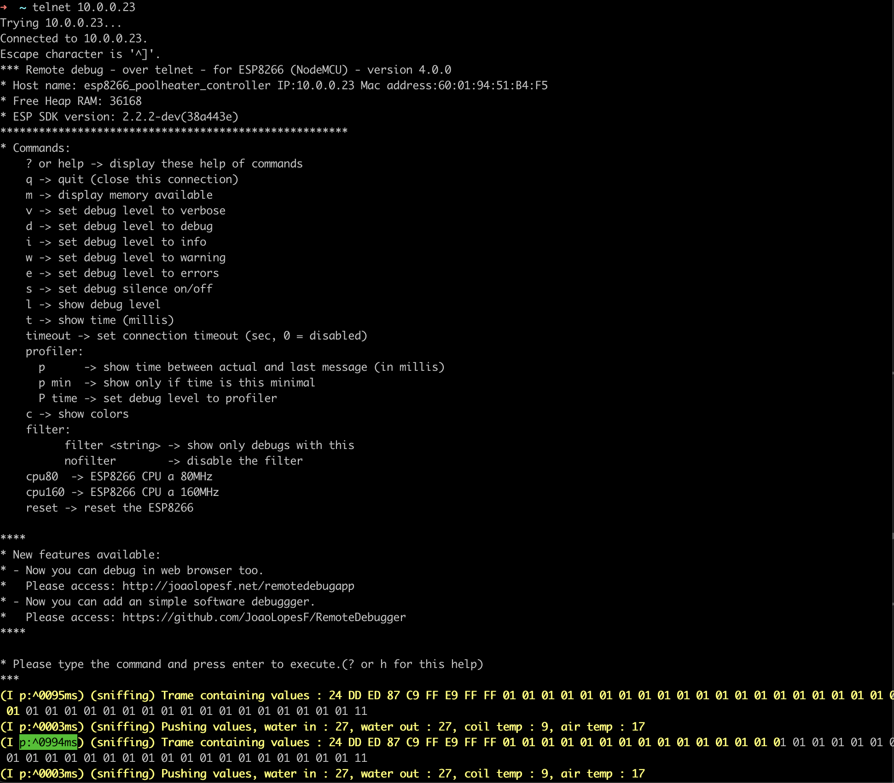
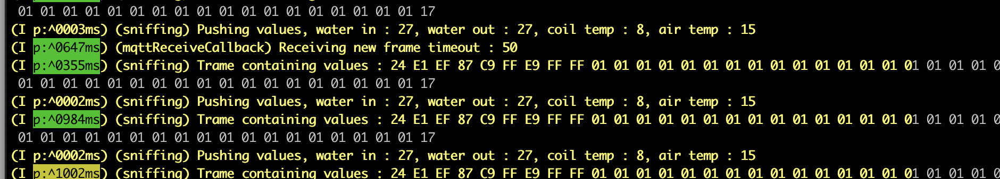
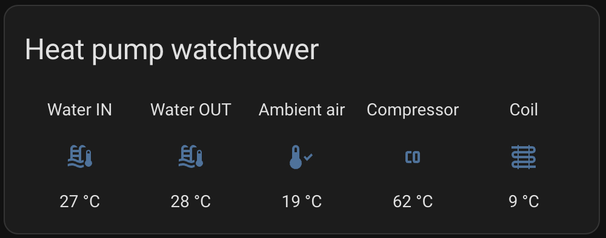

# ESP8266 Poolex heatpump UART parser to MQTT 

This project aims to control Poolex heatpump Jetline series. 
This kind of heatpump use UART protocol (no modbus) - at 9600 8N1, with 50 ms (52 with break condition)

This project is a personal project - dedicated to understand the communication flow through UART of a Poolex Jetline Selection 95 Pool heatpump. 

## State of this project

This project runs on Wemos D1_mini at 160 MHZ, with Wifi interface, Remote Debugger through Telnet.
It reads UART flow, identity patterns of messages, send sensors values to MQTT and receive commands through MQTT. 

It reads :
* Water in and out temperature
* Gas temperature 
* Coil temperature
* Exterior temperature 
* Heatpump ON/OFF status 

It doesn't YET send commands to heat pump.

## Next steps 

Next step is sending commands to Poolex heat pump : 
* Sending TARGET temperature
* Sending programs and Time programmations 
* Start/Shutdown the pump 
* Reading Error codes 

# Hardware 

* Wemos D1_Mini ESP8266
* MAX 485 UART interface 
* Power supply converter from 12v to 5v 
* Wifi bandwith where the heat pump is located 
* Small IP67 box where to put the system

# References & greatings

* From where I started : [esp8266_poolstar repostory](https://github.com/cribskip/esp8266_poolstar)
* Understanding the different protocol : [esp8266 fork from Cyril](https://github.com/cribskip/esp8266_poolstar/issues/2)
* [Python version](https://github.com/cyrilpawelko/poolstarmon/tree/main/micropython)
* [Exploration thread on Heatpump using Modbus](https://community.jeedom.com/t/domotiser-pac-inverter-de-piscine-irrijardin-warmpool-aide-connection-rs485/42440/77?page=5)

# Installation

## IDE and runtime

I use C++ language, Arduino regular library, and PlatformIO development platform.

You need to have the full development environment of [Platform IO](https://platformio.org/platformio-ide) for making this up. 

## Wiring 

I use the controller wiring to connect to the UART bus. 

It's a four wire cable where :
* Green+Yellow : UART RX/TX
* Black+Red : Power supply 12v


I created a harness for making this system disconnectable.

By design, the quality of the connector are very poor. They fastly oxydize. I use DEUTSCH connectors, water proof and high quality designed. 


## Power supply

For the first upload of the program, you will power this up from Micro USB of your computer.

Then, It will be powered from the Panel ( black/red +12v).

You'll need a converter from 12v to 5v with minimum of 2A. 

5V power supply from the converter will supply the MAX485, and the ESP8266 (Wemos here).

 ## Heat pump Panel to MAX485 interface

Heat pump panel has 4 wires. 

Green and Yellow of the panel go to A and B of the MAX485


 ## MAX485 to Wemos D1 Mini

 Yellow of the MAX485 goes to RX of the ESP
 Green of the MAX485 goes to TX of the ESP 
 DE/RE are linked together (you need to do the link), of the MAX485, and goes to pin4 as D2 of the ESP

# Easy to debug for your case 

## Debugging 

I've struggled a lot to understand HOW to isolate messages from the UART bus.

Standard Arduino lib doesn't read break condition.
Without break condition, it's like reading the matrix and understanding the pattern. I don't have time for that. 

So I decided to find a way to isolate message even if I don't have the start or end position. 

Reading a lot of documentation, I figured out it's possible to rely on reading timeout to isolated a frame reception. This allowed me to structure permanently the way I receive UART message. 

Following that, time to decrypt messages.

## Debug functions

This project is designed to speed up the exploration process.

You can : 
* Update on the air (OTA) the Arduino 
* Live debugging through TCP the program  (*Remote Debugger* - this library is awesome)
* Adapt the UART communication framing parameter to adapt according your heatpump 

## Remote Debugging 

For remote debugging : 
```bash
> telnet IP_OF_YOUR_ESP
```


Switching in VERBOSE mode : 


## OTA Update 

With PlatformIO + Vscode, you need to knoww the IP of your ESP.
Then, update your upload process with the TCP protocal and the according IP. 


Uploading : 


## MQTT debugging 

I use MQTT explorer to debug my MQTT flows.

Some values : 


## Adapting the Timeout 

You can update on-the-fly the Reading Timeout of UART messages.
See : 
* [Serial.Timeout](https://www.arduino.cc/reference/en/language/functions/communication/serial/settimeout/)
* [Serial.ReadBytes](https://www.arduino.cc/reference/en/language/functions/communication/serial/readbytes/)
* I use [SoftwareSerial](https://docs.arduino.cc/learn/built-in-libraries/software-serial/) for manipulating Serial

Through MQTT, you can push a unsigned int16 in a RAW message - This is the timeout used by ReadBytes to fill the buffer. Standard is 1000msec - I use 50ms. 


Once published, you will see in your remotedebug flow : 


## Attention

You can totally break the OTA process if you push a bad code or if you overcharge the loop process of the Arduino. 

# Home Assistant integration 

I've chosen to use MQTT for easy integration to Home Assistant. 
ESP Home didn't allow me to fully customize my exploration process so I didn't use it. 

In your configuration.yml : 

```
mqtt:
  
  sensor: 

    - name: "Pool water tempetature"
      state_topic: "poolheater/values/water_in_temp"
      force_update: true
      unit_of_measurement: "°C"

    - name: "Pool water OUT tempetature"
      state_topic: "poolheater/values/water_out_temp"
      force_update: true
      unit_of_measurement: "°C"

    - name: "Heat pump status"
      state_topic: "poolheater/values/active_status"
      force_update: true
      
    - name: "Heat pump ambient air temperature"
      state_topic: "poolheater/values/air_ambient_temp"
      force_update: true

    - name: "Heat pump gaz temperature"
      state_topic: "poolheater/values/gaz_temp"
      force_update: true

    - name: "Heat pump coil temperature"
      state_topic: "poolheater/values/coil_temp"
      force_update: true
```

Results : 



## Contributing

Pull requests are welcome. For major changes, please open an issue first
to discuss what you would like to change.

Please make sure to update tests as appropriate.

## License

[MIT](https://choosealicense.com/licenses/mit/)
